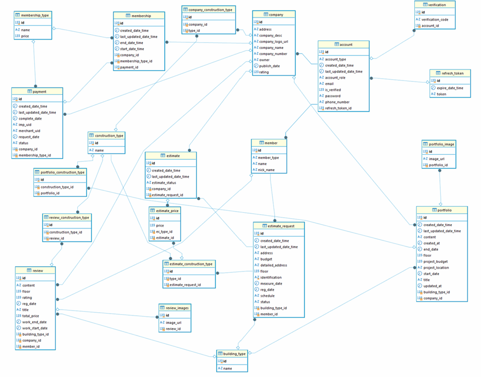
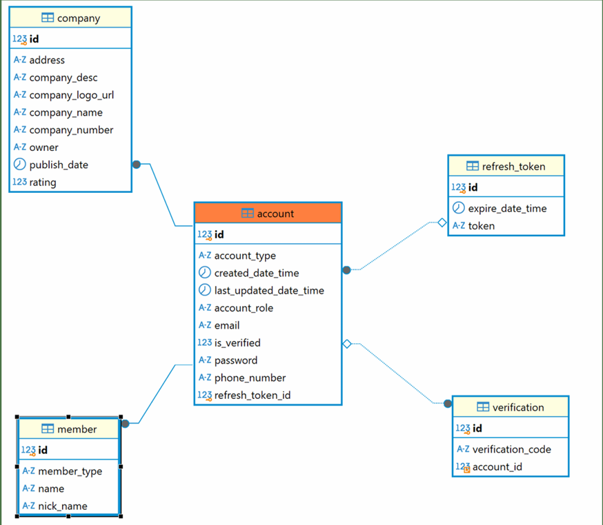
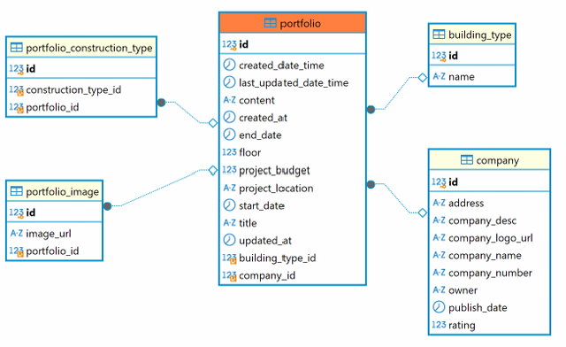
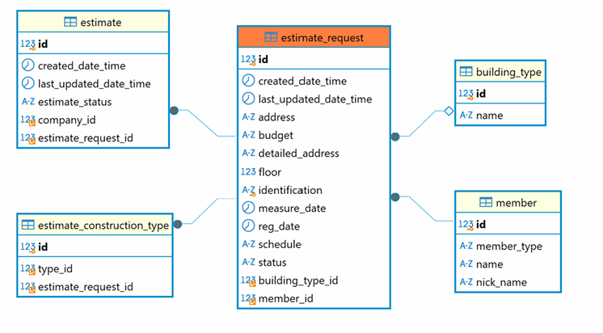
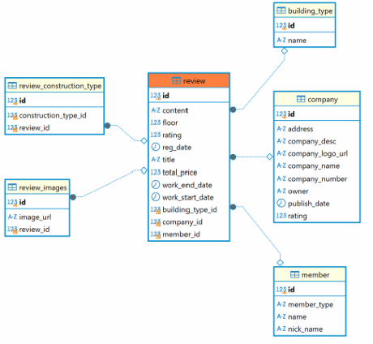
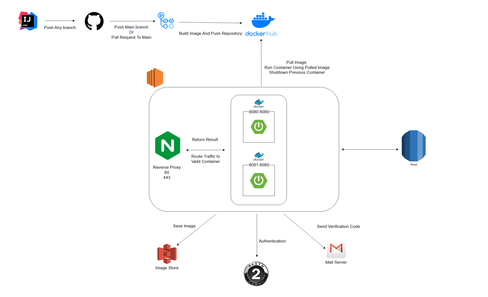

인테리어 중개 플랫폼 Changzipup
==
## 1. 기획 배경
본 프로젝트는 기존 인테리어 중개 플랫폼의 아래와 같은 단점을 개선하고자 시작한 프로젝트입니다.
- 기업 입장에서 부담되는 비용
  - 견적 발송 시 바로 수수료가 부과된다는 단점이 존재했습니다. 
  - 이는 시공 견적을 보낼 때마다 채택되지 않더라도 무조건 수수료를 지불하는 단점이 존재했습니다.
- 고객 입장에서 부담되는 직접 연락
  - 기존 시스템에서는 고객의 핸드폰 번호로 직접 연락하여 고객에게 불편함을 제공하는 단점이 존재했습니다.
  - 초기 견적 금액과 비교할 수 없을

이를 개선하고자 기업 멤버십을 활용하여 멤버십에 가입된 기업 고객에 한해 제공해주는 비즈니스 모델을 채택했습니다.

## 2. ERD
### 전체 ERD

### 회원 ERD

### 시공사례 ERD

### 시공요청 ERD

### 리뷰 ERD

## 3. 아키텍쳐
